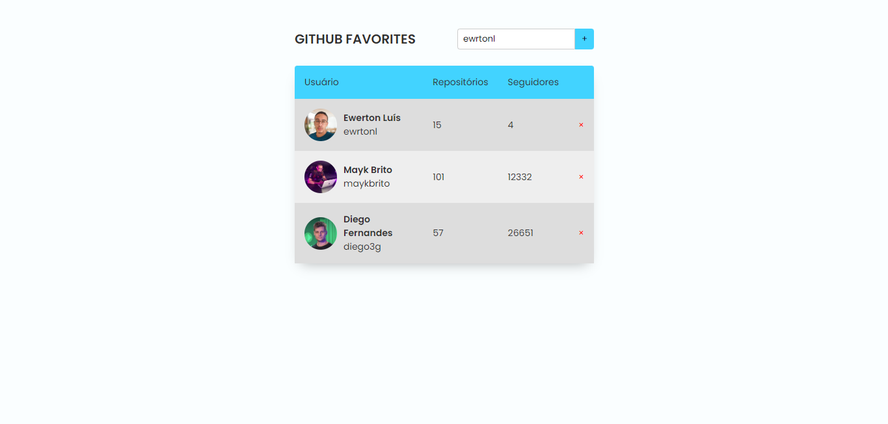

<h1 align='center'>
GitHub Favorites
</h1>

<h1 align='center'>
  
</h1>
<h1 align='center'><a href="https://ewrtonl.github.io/github-favorites/">See the site</a></h1>

## 📕 About

Add your favorite GitHub accounts. 
Using GitHub API to collect the data

## 🔨 Tools

- HTML
- CSS
- JavaScript
